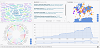
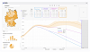
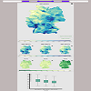
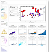

# About Me

 Since 2022, I am working as a PostDoc scientist in Visualisation group of Department of Visual Computing and Enginnering, Institute for Software Technology, German Aerospace Center (DLR), Germany. I am based in Braunschweig office. In my role, I am responsible of conceiving, developing and successfull dissimenination of a Visual Analytics based solutions to the projects. My current projects are related to Visual Analytics in Data Manangement, Visual Analytics of Digital Twins, Visual Analytics of Mobility and Epidemiology. 
    
I did my PhD in 2021  with thesis on "Domain Knowledge Based Visualisation Recommendation System" under the supervision of Professor Birgitta König-Reis from the Friedrich Schiller University Jena, Germany. During my Phd, I was also employed by the university as a Research Assistant. I did my Master Research (MRes) degree in Computer Aided Decision Support System with Internship in 'Visualising Quality of Open Datasets' from  Ecole Polytechnique Tours France, in 2014. 
  
My research interests include application of visual analytics solutions in data management, infrastructure and subsystem analysis, mobility and transportation. human computer interaction (HCI), natural language processing (NLP), spatio-temporal data, graph analytics and uncertainty visualisation.
  
For queries, feel free to contact me.

# Current Projects
 -  [Graph Based Visual Search Engine](https://vesa.webapps.nfdi4earth.de/): A tool to visualise knowledge graph and assist scientists in better data search.
 - [Visual Analytic of Pandemic through Trajectory Analysis](https://www.dlr.de/de/sc/forschung-transfer/projekte/pandemos): A tool to visualise the trajectory during pandemic time to understand the network of infection.
 -  [Spatio-Temporal Visual Analytics of Pandemic](https://www.dlr.de/de/sc/forschung-transfer/projekte/loki-pandemoics): Visualising pandemic simulation data for understanding and deciding effective mitigation measures.

# Previous Projects
  - 
   
Visualisation tool to predicts the probability of the species in different parts of Germany. 
 

  -  Visualisation tool to automatically recommend charts for visualising datasets in data repository.
# Funding
  - [NFDI4Earth for Graph Based Visual Search Engine](https://www.nfdi4earth.de/2participate/pilots)

# Current Students    
  - PhD thesis in visualising uncertainty in Progressive Visualisation

# Previous Master Thesis
  - [Enhancing Uncertainty Communication in Time Series Predictions: Insights and Recommendations](https://arxiv.org/pdf/2408.12365) https://arxiv.org/pdf/2408.12365
  - Hotspot Detection Spatio Temporal Data
  - Visualising Technology Roadmapping: A Case Study from Automobile/Vehicle Industry

    
# Connect with Me
<a href="https://www.linkedin.com/in/pawandeep-kaur-betz-ph-d-30167a18/" target="_blank"><i class="fab fa-linkedin"></i> LinkedIn</a> |
<a href="https://x.com/littlepawan" target="_blank"><i class="fab fa-twitter"></i> Twitter</a> |
<a href="https://www.researchgate.net/profile/Pawandeep-Kaur-24" target="_blank"><i class="fab fa-researchgate"></i> ResearchGate</a> |
<a href="https://scholar.google.com/citations?user=F72WAVkAAAAJ&hl=en" target="_blank"><i class="fab fa-twitter"></i> Google Scholar</a> |

    
     
